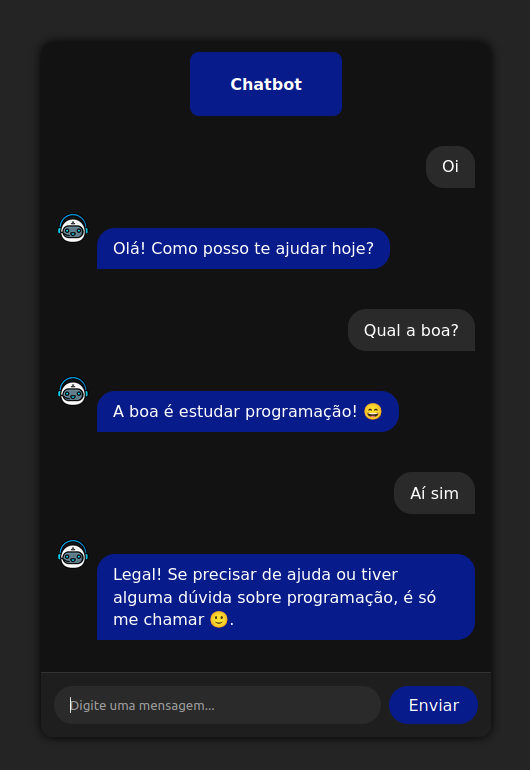

# 🤖 Chatbot com Node.js, React e OpenRouter API

Projeto de chatbot que pode ter o prompt e o modelo IA personalizados, neste caso ele responde perguntas sobre programação de forma amigável e direta, utilizando a API do OpenRouter com o modelo `gpt-3.5-turbo`.

<p align="center">
  
</p>

---

## 🚀 Tecnologias

- **Backend**: Node.js, Express, dotenv, body-parser, cors, node-fetch  
- **Frontend**: React, Axios  
- **API**: [OpenRouter](https://openrouter.ai/)
  
---

## Como Rodar

Cadastre-se em OpenRouter e gere sua chave.

Crie um arquivo .env:
```bash
PORT=3000
OPENROUTER_API_KEY=sua_chave
MODEL=seu_modelo_escolhido
```

## Backend

```cd backend```  
```npm install```  
```node server.js```

## Frontend

``cd frontend``  
``npm install``  
``npm run dev``
